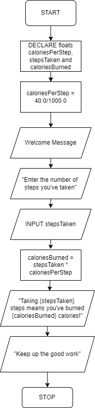

# CS 161A: Programming and Problem Solving I - Assignment 01

## Description

This program helps users calculate the number of calories they’ve burned based on the number of steps they’ve taken. The user will be prompted for the number of steps and after they enter them, the program will calculate and display the number of calories burned.

> No code was required for this assignment.

## Sample run

```Welcome to the Steps-to-Calories calculator!
Enter the number of steps you’ve taken:
12000

Taking 12000 steps means you’ve burned 480 calories!

Keep up the great work!
```

## Input

`CALORIES_PER_STEP` - const float

`stepsTaken` - integer (user entered)

## Output

`caloriesBurned` - float
Display message - output stream - string/float

## Calculations

### Calories per step (40 calories / 1,000 steps)

`CALORIES_PER_STEP = 40 / 1000`

### Calories Burned

`caloriesBurned = stepsTaken \* CALORIES_PER_STEP`

## Pseudocode

```
DECLARE float CALORIES_PER_STEP = 40.0/1000.0

DECLARE integer stepsTaken

DECLARE float caloriesBurned

DISPLAY “Welcome to the Steps-to-Calories calculator!”

DISPLAY “Enter the number of steps you’ve taken:”

INPUT stepsTaken

SET caloriesBurned = stepsTaken \* caloriesPerStep

DISPLAY “Taking {stepsTaken} steps means you’ve burned {caloriesBurned} calories!”

DISPLAY “Keep up the great work!”
```

## Flowchart


