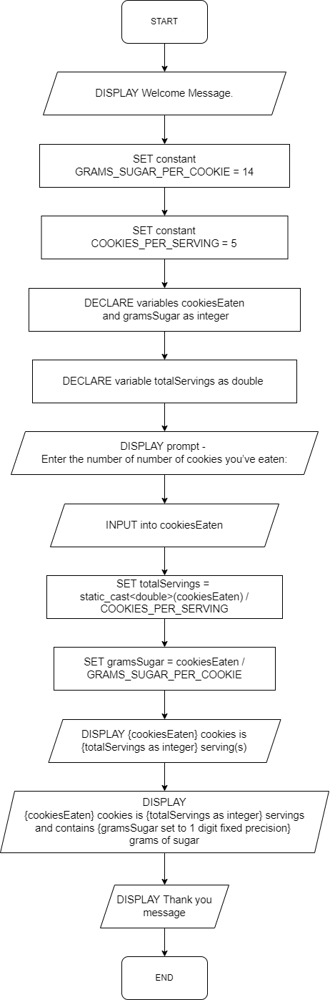

# CS 161A: Programming and Problem Solving I - Assignment A03

## Description

It’s easy for one to eat too many Oreos cookies without realizing how much sugar they contain. This program will read the number of cookies eaten by the user (integer) and calculate the number of servings (double) and the number of grams of sugar (integer) that exist in that number of cookies.

## Sample run

```
Welcome to the Oreo sugar calculator!

Please enter the number of cookies you've eaten:
> 12

12 cookies is 2.4 servings and contains 168 grams of sugar.

Thanks for enjoying Oreos!
```

```
Welcome to the Oreo sugar calculator!

Please enter the number of cookies you've eaten:
> 3

3 cookies is 0.6 servings and contains 42 grams of sugar.

Thanks for enjoying Oreos!
```

## Input

- `cookiesEaten` as integer

## Output

- `totalServings` as double
- `gramsSugar` as integer

## Calculations

### Total servings in a given number of cookies

`totalServings = static_cast<double>(cookiesEaten) / COOKIES_PER_SERVING`

### Total amount of sugar in grams

`gramsSugar = cookiesEaten * GRAMS_SUGAR_PER_COOKIE`

## Pseudocode

```
DISPLAY Welcome Message.

DECLARE constant GRAMS_SUGAR_PER_COOKIE = 14
DECLARE constant COOKIES_PER_SERVING = 5

DECLARE variables cookiesEaten and gramsSugar as integer
DECLARE variable totalServings as double

DISPLAY prompt - Enter the number of number of cookies you’ve eaten:
INPUT into cookiesEaten

SET totalServings = static_cast<double>(cookiesEaten) / COOKIES_PER_SERVING

SET gramsSugar = cookiesEaten / GRAMS_SUGAR_PER_COOKIE

DISPLAY {cookiesEaten} cookies is {totalServings as integer} servings and contains {gramsSugar set to 1 digit fixed precision} grams of sugar

DISPLAY Thank you message

END program
```

## Flowchart


