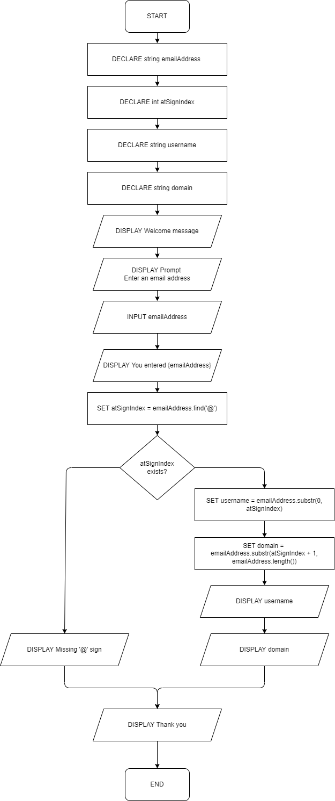

# CS 161A: Programming and Problem Solving I - Assignment A05

## Description

This program will break a user-entered email address into its constituent parts: username and domain. If the email address is missing an '@' symbol, an error will be displayed instead.

## Sample Run

```
Welcome to the Email Address Breakdown program!

Enter an email address: keegan.good@pcc.edu

You entered: keegan.good@pcc.edu
Username: keegan.good
Domain Name: pcc.edu

Thank you for using the Email Address Breakdown program!
```

```
Welcome to the Email Address Breakdown program!

Enter an email address: test@example.com

You entered: test@example.com
Username: test
Domain Name: example.com

Thank you for using the Email Address Breakdown program!
```

```
Welcome to the Email Address Breakdown program!

Enter an email address: keegan.goodpcc.edu

You entered: keegan.goodpcc.edu

This is missing the "@" sign. Please check and try again later.

Thank you for using the Email Address Breakdown program!
```

## Inputs

`emailAddress` as string

## Outputs

`username` as string
`domain` as string

## Calculations

### Locate the ‘@’ symbol in the email address

`atSignIndex = emailAddress.find(‘@’)`

### Split the email address into its username and domain

`username = emailAddress.substr(0, atSignIndex)`

`domain = emailAddress.substr(atSignIndex + 1, emailAddress.length()) `

## Flowchart


